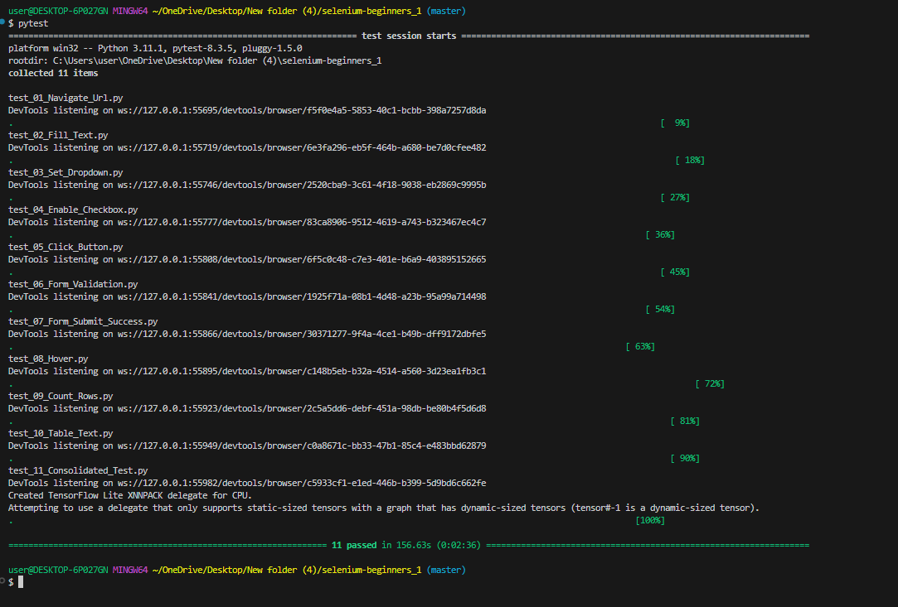

## 📘 Day-6: PyTest, ML Model Testing & Industry Insights

Day-6 of the Skill Lab was centered around **testing in machine learning** and gaining valuable insights into the tech industry. The session began with an introduction to **PyTest**, a powerful testing framework in Python. Students learned how to write and run test cases, with a particular focus on validating **machine learning models**. Through hands-on exercises, participants gained practical experience in checking model performance, verifying outputs, and ensuring robustness in ML workflows.

A significant part of the learning experience was shaped by the **guidance and dedication of mentors Avinash Sir and Shivhari Sir**. Their enthusiastic and optimistic approach created an engaging and supportive learning environment. They patiently addressed every doubt, ensured clarity on each topic, and motivated students to explore beyond the basics.

Later in the session, both mentors shared valuable knowledge about the **current tech market**, especially from the perspective of **newcomers entering the industry**. Discussions included how to prepare for roles in tech companies, what skills are in demand, and how to approach job opportunities with confidence.

Overall, the day provided a strong blend of technical skills and career guidance, making it both a practical and motivational experience for all learners.

